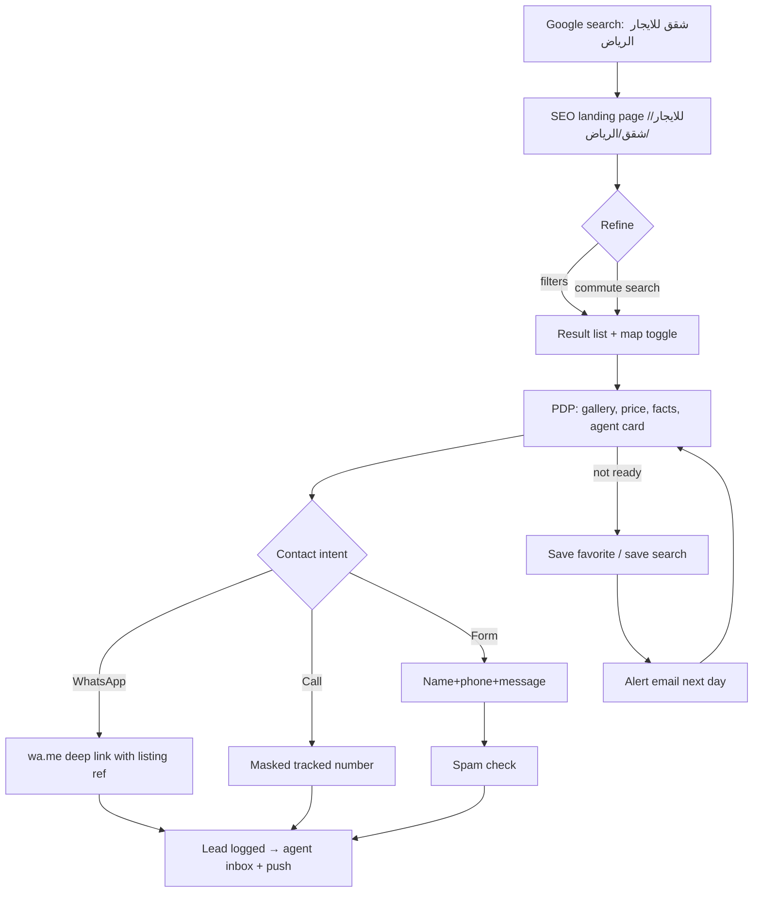
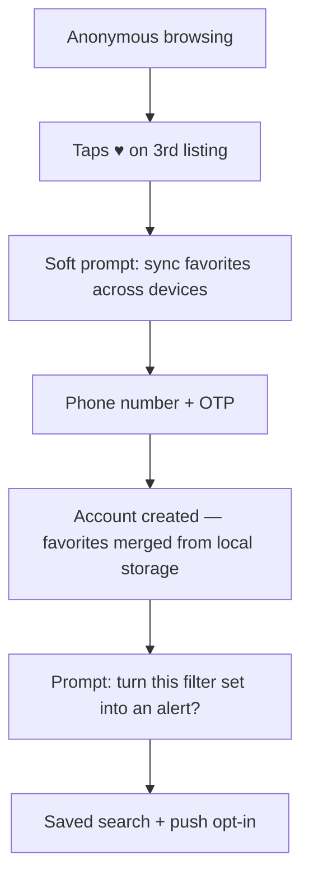
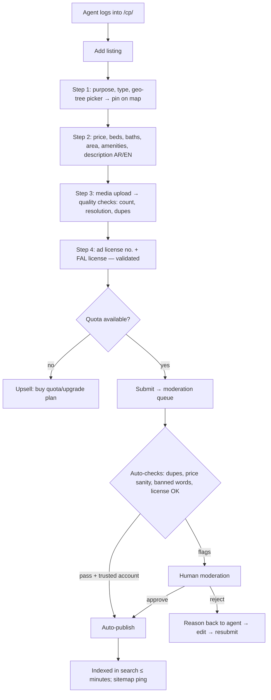
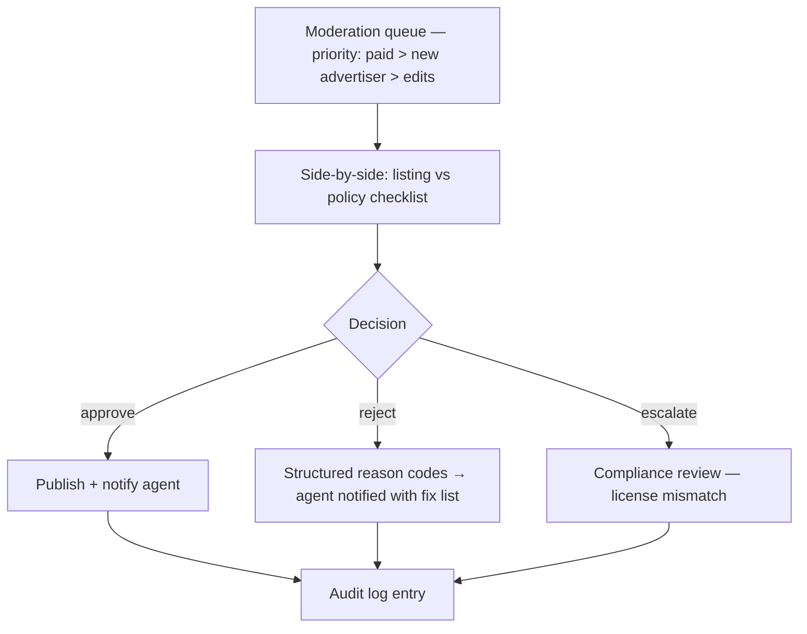

# Bayut.sa — Product Discovery & Reverse-Engineering Document
### Enterprise PRD / Technical Discovery for Building a Bayut-Scale Real-Estate Marketplace

**Prepared by:** Code-OX · Shabeeb Kaip, Head of Operations
**Date:** 9 July 2026
**Target analyzed:** https://www.bayut.sa (Bayut KSA — Dubizzle Group platform family)
**Method:** Live technical recon (rendered DOM, robots.txt, URL architecture, schema markup, hreflang) + product inference from the Bayut/Dubizzle platform family + KSA real-estate market knowledge. Items that could not be directly observed are marked **[inferred]**.

**Live evidence captured 9 July 2026:**
- Arabic-first (`<html lang="ar" dir="rtl">`), English at `/en/` with correct `hreflang` pairs and canonicals
- SEO URL hierarchy: `/للبيع/العقارات/{city}/{district}/{community}/{project}/` — purpose → category → geo-tree, in Arabic slugs
- Query-param features on the homepage itself: `?map_active=true`, `?commute_active=true` (drive-time search), `?videos_min=1`, `?panoramas_min=1` (media-verified inventory filters)
- robots.txt discloses: `/cp/` (agent control panel), `/adserver/` (in-house ad serving), `/trends/` (market data product), `/community/answers|discussions` (Q&A product), `/wanted/` (buyer-request marketplace), `/international/`, region-level URL trees, and deliberate de-indexing of filter permutations (`*?baths_in*`, `*price_min*`) — a crawl-budget strategy
- `/brokers/` agent directory and `/الشركات-العقارية/` (real-estate companies directory) linked from the homepage
- `favorite-properties.html` (favorites without forced login), Organization JSON-LD on the homepage
- Infrastructure: CloudFront CDN fronted by HUMAN Security bot defense (401 + `hb-challenge`/`hb-captcha` to non-browser clients) — scraping protection is a first-class platform concern

---

# SECTION 1: EXECUTIVE SUMMARY

**What Bayut.sa is.** A property classifieds marketplace ("portal") for Saudi Arabia: a two-sided platform where real-estate agencies, brokers, and developers pay to list and promote residential/commercial inventory, and consumers search, compare, and contact advertisers for free. It is the KSA arm of the Bayut brand (Dubizzle Group), sharing the platform DNA of bayut.com (UAE) — the most mature property portal product in MENA.

**Target audience.**
- *Demand side:* Saudi nationals and expats renting or buying homes; investors; commercial tenants. Mobile-first, Arabic-first, WhatsApp-native.
- *Supply side:* licensed brokers (REGA/FAL-licensed), brokerages, property developers selling off-plan projects, and (secondarily) private owners.

**Core value proposition.**
- To consumers: the largest searchable, filterable, map-driven inventory with trustworthy data (verified listings, market trends, price intelligence) — free.
- To advertisers: qualified purchase-intent leads (calls, WhatsApp, emails) at scale, plus brand visibility — sold via subscriptions and promoted-placement products.

**Business model.** B2B SaaS-meets-media: agencies buy listing quotas + promotion products (Featured/Signature), developers buy project-marketing packages, plus display advertising via an in-house adserver (`/adserver/` confirmed in robots.txt). Consumers are never charged; leads are the product.

**Competitive advantages observed.**
1. SEO moat — thousands of indexable purpose×type×geo landing pages in Arabic and English (URL tree confirmed live), with deliberate crawl-budget engineering.
2. Geo data asset — a proprietary location tree (region→city→district→community→project) that competitors cannot copy quickly.
3. Content/data products — TruEstimate-style valuations, market trends (`/trends/`), community Q&A — that convert SEO traffic into brand trust.
4. Group synergies — shared tech with bayut.com/dubizzle; cross-market advertiser relationships.
5. Anti-scraping infrastructure (HUMAN Security) protecting the inventory asset.

**Estimated product maturity: 8/10.** Mature core (search, geo, listings, agent portal, monetization, bilingual SEO), with newer surfaces (community Q&A, wanted-ads, trends) still expanding in KSA relative to the UAE flagship.

---

# SECTION 2: USER ROLES

### 1. Visitor (anonymous)
Browse/search/filter listings; map + commute search; view property details; view agent/agency/developer profiles; use calculators; read blog/trends/Q&A; call or WhatsApp an advertiser (identity-free contact); save favorites locally (`favorite-properties.html` works pre-login); switch AR/EN.

### 2. Registered Consumer
Everything a Visitor can, plus: persistent favorites synced across devices; saved searches with instant/daily/weekly email & push alerts; recently viewed; enquiry history; profile & notification preferences; post a "Wanted" request **[from /wanted/]**; ask/answer community questions.

### 3. Private Property Owner (FSBO) **[inferred — KSA regulation (REGA) restricts advertising to licensed parties; likely funneled to brokers or required to hold an ad license]**
Submit a listing with mandatory ad-license number; manage own listing; receive enquiries; upgrade visibility.

### 4. Real-Estate Agent (broker, FAL license)
Profile page in `/brokers/` directory; create/edit/publish listings within agency quota; upload media; receive & manage leads (calls/WhatsApp/emails); performance stats per listing; respond to reviews **[inferred]**; TruBroker™-style activity badges **[platform family]**.

### 5. Agency (brokerage account)
Agency profile page; manage agent seats; allocate listing quota & promoted credits across agents; consolidated lead inbox & routing rules; analytics dashboards; billing, invoices, subscription management; bulk upload / XML feed / CRM sync.

### 6. Developer
Project (new-build) pages with off-plan inventory, payment plans, brochures; project lead campaigns; sales-team lead routing; featured project placements (confirmed: `مشاريع-جديدة` new-projects section live).

### 7. Content/Community Moderator (staff)
Approve/reject listings; enforce photo/text standards; handle reported listings; moderate Q&A; manage takedowns.

### 8. Sales & Account Manager (staff)
Manage advertiser accounts, quotas, contracts, renewals; configure packages; issue credits/refunds.

### 9. Platform Admin (staff)
Full platform management: users, roles, geo tree, taxonomy, pricing, CMS, SEO, ads, compliance, audit.

### 10. Super Admin / System
Role & permission administration, feature flags, environment config, data exports, integrations.

## Permissions Matrix

| Capability | Visitor | Consumer | Owner | Agent | Agency Admin | Developer | Moderator | Sales Ops | Admin |
|---|:-:|:-:|:-:|:-:|:-:|:-:|:-:|:-:|:-:|
| Search & view listings | ✅ | ✅ | ✅ | ✅ | ✅ | ✅ | ✅ | ✅ | ✅ |
| Contact advertiser (call/WA/form) | ✅ | ✅ | — | — | — | — | — | — | — |
| Save favorites | local | ✅ | ✅ | ✅ | ✅ | ✅ | — | — | — |
| Saved searches + alerts | ❌ | ✅ | ✅ | ✅ | ✅ | ✅ | — | — | — |
| Post Wanted request | ❌ | ✅ | ✅ | — | — | — | — | — | ✅ |
| Create listing | ❌ | ❌ | ✅* | ✅ | ✅ | ✅ | ❌ | ❌ | ✅ |
| Edit/delete own listing | — | — | ✅ | ✅ | ✅ (all agency) | ✅ (own projects) | ❌ | ❌ | ✅ |
| Promote listing (featured) | — | — | ✅ paid | via credits | ✅ | ✅ | ❌ | ✅ grant | ✅ |
| View lead inbox | — | — | own | own | agency-wide | project-wide | ❌ | read-only | ✅ |
| Lead routing rules | — | — | — | ❌ | ✅ | ✅ | ❌ | ✅ | ✅ |
| Manage agent seats | — | — | — | ❌ | ✅ | ✅ | ❌ | ✅ | ✅ |
| Analytics dashboards | — | — | own listing | own | agency | project | — | portfolio | platform |
| Approve/reject listings | — | — | — | — | — | — | ✅ | ❌ | ✅ |
| Manage subscriptions/billing | — | — | own | ❌ | ✅ | ✅ | ❌ | ✅ | ✅ |
| Manage geo tree / taxonomy | — | — | — | — | — | — | ❌ | ❌ | ✅ |
| CMS / blog / SEO settings | — | — | — | — | — | — | ❌ | ❌ | ✅ |
| Impersonate accounts / audit logs | — | — | — | — | — | — | ❌ | ❌ | ✅ |

\* Owner listing subject to ad-license verification (KSA REGA compliance) and moderation.

---

# SECTION 3: COMPLETE FEATURE INVENTORY

## 3.1 PROPERTY DISCOVERY

| Capability | Status | Notes / evidence |
|---|---|---|
| Keyword search (city/community/project autocomplete) | ✅ confirmed | Homepage search; autocomplete over the geo tree + projects |
| Purpose toggle (Buy / Rent / New Projects) | ✅ confirmed | URL purpose segments للبيع / للايجار; new-projects tree |
| City / district / community browse | ✅ confirmed | 4-level geo URLs live on homepage |
| Map search (bounded-box) | ✅ confirmed | `?map_active=true` |
| Commute / drive-time search | ✅ confirmed | `?commute_active=true` — isochrone filtering by travel time to a chosen point |
| Nearby search (around-me geolocation) | ✅ app / [inferred web] | Mobile-first pattern in platform family |
| Radius / draw-area search | ✅ [platform family] | Map polygon/draw tools |
| Landmark search | ✅ [inferred] | Commute-to-landmark covers this |
| Media-verified discovery | ✅ confirmed | `?videos_min=1`, `?panoramas_min=1` — filter to listings with video/360° |
| Trending / most-viewed surfaces | ✅ confirmed | `/trends/` product |
| Agent/agency directory search | ✅ confirmed | `/brokers/`, real-estate-companies directory |
| Wanted (reverse marketplace: buyers post, agents respond) | ✅ confirmed | `/wanted/` in robots |
| Saved-search re-run + alerting | ✅ | Core retention loop |

## 3.2 FILTERS

For each filter: **UV** = user value, **DB** = database requirement, **API** = API requirement.

| Filter | UV | DB | API |
|---|---|---|---|
| Purpose (buy/rent/daily rent) | First fork of intent | `listings.purpose` enum, part of every index | Path segment, not query param (SEO) |
| Property type & subtype (apartment, villa, floor, land, farm, istiraha, building, office, shop, warehouse…) | KSA-specific taxonomy is a moat | `property_types` tree (2 levels), FK on listing | `type` param; drives URL slug |
| Price min/max | Budget is the #1 constraint | `price` indexed numeric; rent frequency column | `price_min/max`; **de-indexed from SEO (robots)** |
| Rent frequency (yearly/monthly/daily) | Rental market norm | `rent_frequency` enum | param |
| Bedrooms / Bathrooms (incl. studio, 7+) | Household fit | smallint indexed; studio=0 convention | `beds_in`, `baths_in` (robots confirms param names) |
| Area min/max (sqm) | Size fit | `area_sqm` numeric indexed | `area_min/max` |
| Furnishing | Rental decision factor | enum furnished/unfurnished/partly | param |
| Completion status (ready / off-plan / under construction) | New-projects market | enum + `completion_pct`, `handover_date` | param; separate new-projects tree |
| Developer | Off-plan trust | `developers` table FK | param + developer landing pages |
| Property age | Condition proxy | `built_year` | derived buckets |
| Amenities (pool, maid room, driver room, elevator, private roof, yard…) | Long-tail differentiation | `amenities` master + M2M join; bitmap/array for search index | multi-value param |
| Media filters (photos_min, videos_min, panoramas_min) | Quality-first browsing | media counts denormalized on listing | confirmed params |
| Verified / TruCheck™-style badge | Trust | `verified_at`, `verification_type` | boolean param |
| Keyword within description | Edge-case power search | full-text index (Elasticsearch) | `q` param |
| Agent/agency filter | Follow trusted brokers | FK | agency/agent scoped routes |
| Sort (newest, price ↑↓, most relevant, most photos) | Control | composite indexes per sort | `sort` param |

**Architecture note [inferred]:** filter counts ("Villas (1,243)") shown per node require aggregation queries — Elasticsearch faceted aggregations, not SQL, at this scale.

## 3.3 PROPERTY DETAILS PAGE (PDP)

| Section | Frontend | Backend | DB entities |
|---|---|---|---|
| Media gallery (photos, count badge, fullscreen, swipe) | Lazy carousel, CDN `srcset`, skeletons | Media service: upload, virus-scan, EXIF strip, watermark, multi-size renditions, ordering | `listing_media` (type, url, order, width, height, is_cover) |
| Video & 360° panorama | Embedded player / pano viewer | Transcode pipeline (HLS), pano hosting | `listing_media.type ∈ {photo,video,pano}` |
| Price + rent frequency + negotiability | Prominent header block | Price history retained for trends | `listings.price`, `price_history` |
| Key facts (beds, baths, area, type, purpose, furnishing, age) | Icon strip | Denormalized on listing read model | `listings.*` |
| Description (AR/EN) | Collapsible rich text | Bilingual columns; auto-translation assist [inferred] | `listing_translations` |
| Location block + map pin | Static map → interactive on tap (cost control) | Geocode validation against geo tree | `listings.lat/lng`, `location_id` |
| Nearby places (schools, mosques, hospitals, malls) | Tabbed POI list with distances | POI dataset + geo radius queries (or Places API cached) | `pois`, `poi_categories` |
| Building/project info (floors, units, developer) | Card | Project registry join | `projects`, `buildings` |
| Floor plans | Image/PDF viewer | Media type = floorplan | `listing_media` |
| Amenities grid | Chips grouped by category | M2M read | `listing_amenities` |
| Mortgage calculator | Client-side calc (price, down %, tenor, APR) | Optional bank-partner rate feed [inferred] | `mortgage_partners` (optional) |
| Agent/agency card (photo, name, license, languages) | Trust block with logo | Advertiser read model | `agents`, `agencies` |
| Contact CTAs: Call / WhatsApp / Email form | Sticky mobile bar; number masked until tap | Lead service: log every CTA, tracked/masked numbers, anti-spam | `leads` (type, listing, agent, source, ts) |
| Regulatory info (FAL license no., ad license no.) | Footer of PDP — legally required in KSA | Validation at listing creation against license registry [inferred: REGA integration] | `listings.ad_license_no`, `agents.fal_license_no` |
| Reference no. + report listing | Modal report flow | Moderation queue intake | `listing_reports` |
| Similar properties | Card rail | Similarity: same community + type ± price band; later ML | search index query |
| Breadcrumbs (geo tree) | SEO + wayfinding | Geo tree service | `locations` |
| Share (WhatsApp/copy) | Native share + OG tags | OG image generation per listing | — |
| Schema markup | — | JSON-LD: `RealEstateListing` / `Product`+`Offer`, `BreadcrumbList` [Organization confirmed on home] | — |

## 3.4 MAP EXPERIENCE

| Aspect | Finding / requirement |
|---|---|
| Provider | Google Maps stack [inferred from ecosystem; abstract behind a map adapter to allow HERE/Mapbox swap] |
| Pin clustering | Server-side geohash clustering above zoom thresholds; counts per cluster; client clustering only at deep zoom |
| Bounded search | Map viewport → `bbox` param → geo query on search index (`geo_bounding_box`) |
| Polygon / draw search | Client draws polygon → `geo_polygon` filter [platform family] |
| Commute search (confirmed) | Isochrone service (travel-time polygons; Google Distance Matrix or OSRM/Valhalla) intersected with listing points — differentiating feature |
| District overlays | GeoJSON boundary polygons per district/community stored in geo tree; hover highlights + counts |
| Nearby facilities | POI layers toggled per category |
| Performance | Listing markers served from a tile-friendly endpoint with short-TTL cache; never render >200 pins raw |

## 3.5 USER ACCOUNT FEATURES

| Feature | Notes |
|---|---|
| Registration / login | Phone-OTP first (KSA norm), plus email, Google/Apple social [platform family]. Absher-style national verification not required for consumers |
| Favorites | Pre-login local storage (confirmed `favorite-properties.html`), merged into account at signup — a deliberate low-friction funnel |
| Saved searches + alerts | Full filter state serialized; instant/daily/weekly digests via email + push |
| Recently viewed | Client + server merge |
| Enquiry history | "You contacted 5 agents" — retention + dedupe |
| Compare tool | 2–4 listings side-by-side [gap in family; see §13] |
| Preferences | Language, currency/units, notification channels |
| Delete account / data export | PDPL (Saudi data-protection law) requirement |

## 3.6 LEAD MANAGEMENT

| Feature | Requirement |
|---|---|
| Enquiry form | Name/phone/message, pre-filled listing ref; spam control (rate limits, HUMAN/behavioral scoring — bot defense confirmed present) |
| Click-to-call | Tracked masked numbers per listing/agent [inferred — standard portal call-tracking]; log even when masked numbers unavailable |
| WhatsApp CTA | Deep link `wa.me/<agent>?text=<listing ref + URL>`; logged as lead event |
| Email lead | Templated email to agent + CC agency; stored in inbox |
| SMS fallback | For non-smartphone advertisers [inferred] |
| Lead attribution | Source (search/PDP/profile/campaign), device, session; feeds advertiser ROI reporting |
| Agent assignment & routing | Round-robin / listing-owner / project sales team; agency-configurable |
| Lead inbox | Status pipeline (new → contacted → qualified → closed), notes, reminders |
| CRM integration | Outbound webhooks + REST pull; Salesforce/HubSpot/Bitrix connectors [inferred for enterprise agencies] |
| Lead quality feedback | Advertiser marks junk/duplicate — feeds spam models and billing disputes |

## 3.7 AGENT PORTAL (the `/cp/` control panel — path confirmed)

Add/edit listing (wizard: location → details → media → license → preview); draft & scheduled publish; media manager with quality warnings (min photos, resolution); quota meter (listings used/available); promoted-credit application (make Featured); lead inbox with contact reveal; per-listing analytics (views, impressions, CTR, leads by channel); profile management (photo, bio AR/EN, languages, license); performance badges (response rate); renew/refresh listing; mark rented-sold (auto-archive + "similar" redirect fuel).

## 3.8 AGENCY PORTAL

Agency profile (logo, description, service areas, license); agent seat management (invite, suspend, transfer listings); quota & credit allocation per agent; consolidated lead inbox + routing rules; dashboards (listings live, lead volume by agent/community, response times, promoted-product ROI); bulk tools (CSV/XML feed import, API keys); billing (plan, invoices, VAT, payment methods, renewal); sub-brand/branch management [inferred for large brokerages].

## 3.9 ADMIN PANEL (staff — reverse-engineered)

| Module | Purpose | Key screens | Key actions | Roles |
|---|---|---|---|---|
| Dashboard | Platform health | KPIs: listings live, DAU, leads/day, revenue MTD, moderation backlog | drill-down | all staff |
| Users | Consumer accounts | search, detail, activity | suspend, merge, GDPR/PDPL export & erase | admin |
| Advertisers | Agencies/agents/developers | account 360°, contract, quota, credits | create, verify license, adjust quota, impersonate | sales ops, admin |
| Listings | Inventory control | moderation queue, search, detail-with-diff | approve, reject w/ reason, edit, takedown, feature | moderator+ |
| Verification | Trust programs | license-check queue (FAL/ad license), TruCheck visit scheduling [family] | verify, revoke | moderator |
| Leads | Lead oversight | search, spam review, dispute resolution | reassign, refund credit, blacklist | sales ops |
| Geo & Taxonomy | The location tree asset | tree editor (region→city→district→community→project), boundary GeoJSON upload, amenity/type masters | CRUD, merge, redirect old slugs | admin |
| Projects/Developers | Off-plan registry | project editor (units, payment plans, brochures, progress %) | CRUD, link inventory | content ops |
| CMS & Blog | SEO content | article editor AR/EN, category pages, guides | publish, schedule | content |
| SEO | Search performance | slug manager, redirects, meta templates per page-type, sitemap controls, robots rules | edit templates, regenerate sitemaps | SEO team |
| Adserver | Display revenue | campaigns, creatives, targeting (geo/section), pacing | book, pause, report | ad ops |
| Plans & Pricing | Commercial catalog | plan builder (quotas, credits, durations), promo codes | CRUD, grandfathering | admin |
| Payments | Money | invoices, VAT, gateway reconciliation (Mada/Visa/AmEx/SADAD [inferred]), dunning | refund, retry, credit note | finance |
| Reports | BI exports | supply/demand by geo, advertiser churn, lead funnels, content performance | schedule, export | management |
| Notifications | Comms | template manager (email/SMS/push AR+EN), campaign send, throttles | send, A/B | marketing |
| Moderation & Reports | UGC safety | reported listings/Q&A queue | action, warn, ban | moderator |
| Compliance | Regulatory | REGA/ad-license audit trail, takedown log, PDPL requests | respond, document | legal |
| Audit Log | Forensics | every staff action, before/after | search, export | super admin |
| Support | Tickets | omnichannel inbox, macros, SLA timers | respond, escalate | support |
| Feature Flags & Config | Safe rollout | flags, experiments, env config | toggle, target % | super admin |

---

# SECTION 4: USER JOURNEYS

### 4.1 Visitor → Property Enquiry (the money path)

### 4.2 Visitor → Registration (friction-last design)

Key insight (confirmed by `favorite-properties.html` working pre-login): registration is *requested at the moment of stored value*, never before.

### 4.3 Agent → Listing Creation

### 4.4 Admin → Property Approval

### 4.5 Agency Onboarding → First Lead **[inferred commercial flow]**
Sales-assisted: lead → demo → contract (plan + quota + credits) → account provisioning → agents invited → feed/bulk import of existing inventory → moderation batch pass → go-live → first-week success call with lead-volume report.

# SECTION 5: DATABASE DESIGN

Postgres as system-of-record; Elasticsearch/OpenSearch as the search read model; Redis for sessions/counters. Key tables (PK `id` UUID, timestamps on all, soft-delete where noted):

**Identity & access**
- `users` — phone (unique, E.164), email, name, locale, status, last_login_at
- `roles` / `permissions` / `role_permissions` / `user_roles` — RBAC
- `otp_codes` — user_id/phone, code hash, purpose, expires_at
- `sessions` / `devices` — push tokens per device, platform

**Geo & taxonomy (the moat)**
- `locations` — parent_id (adjacency + materialized `path`), level (region|city|district|community|project-area), name_ar, name_en, slug_ar, slug_en, lat/lng, boundary (GeoJSON/PostGIS geometry), listing_counts (denorm, refreshed)
- `property_types` — parent_id, name_ar/en, slug, icon
- `amenities` / `amenity_categories`
- `pois` — category, name, lat/lng, location_id

**Supply**
- `agencies` — name_ar/en, slug, logo, license_no, license_expiry, status, plan_id, quota_total/used, credits_balance
- `agents` — user_id FK, agency_id FK, fal_license_no, photo, bio_ar/en, languages[], whatsapp, response_stats, badges[]
- `developers` — profile + portfolio
- `projects` — developer_id, location_id, name, status (announced|under_construction|handover), completion_pct, handover_date, payment_plans JSONB, brochures
- `listings` — agency_id, agent_id, project_id?, location_id, type_id, purpose, price, rent_frequency, beds, baths, area_sqm, furnished, completion_status, built_year, ad_license_no, reference_no (public), title_ar/en, description_ar/en, lat/lng (+ geohash), status (draft|pending|live|rejected|expired|archived), verified_at, featured_until, refreshed_at, media_counts JSONB, quality_score, views_count. Indexes: (purpose,type_id,location_path,price), geohash, status
- `listing_media` — listing_id, type (photo|video|pano|floorplan), url, order, is_cover, width/height, checksum
- `price_history` — listing_id, price, changed_at
- `listing_reports` — reporter, reason, status
- `wanted_requests` — consumer buy/rent briefs: purpose, type, locations[], budget, contact prefs; `wanted_responses` from agents

**Demand & engagement**
- `favorites` — user_id, listing_id (unique pair)
- `saved_searches` — user_id, filter_state JSONB, frequency (instant|daily|weekly), channel flags, last_sent_at
- `recently_viewed` — capped per user
- `leads` — listing_id, agent_id, agency_id, user_id?, type (call|whatsapp|form|email|sms), contact JSONB, message, source page, session_id, status pipeline, is_spam, created_at. Partition by month
- `notifications` — user_id, template, payload, channel, sent/read timestamps

**Commercial**
- `plans` — name, listing_quota, featured_credits, duration, price, currency, is_active
- `subscriptions` — agency_id, plan_id, starts/ends, status, auto_renew
- `credit_ledger` — agency_id, delta, reason (purchase|featured_spend|refund|grant), balance_after
- `orders` / `invoices` / `payments` — gateway refs, VAT (15%), status; `invoice_lines`
- `ad_campaigns` / `ad_creatives` / `ad_impressions_daily` — in-house adserver

**Platform**
- `cms_pages` / `blog_posts` / `qa_questions` / `qa_answers` — bilingual content
- `seo_meta_templates` — page_type → title/description patterns with variables
- `redirects` — old_slug → new_slug (geo renames)
- `audit_logs` — actor, action, entity, before/after JSONB, ip
- `feature_flags`, `settings`

**Key relationships:** agency 1-N agents 1-N listings; listing N-1 location (tree); listing M-N amenities; listing 1-N media/leads; user 1-N favorites/saved_searches; agency 1-N subscriptions 1-N invoices; project 1-N listings.

---

# SECTION 6: API ARCHITECTURE

REST (public read surface, cacheable) + authenticated JSON API; `/v1/` versioning; bilingual via `Accept-Language`/`?lang=`. Representative inventory:

**Auth**
| Endpoint | Method | Request → Response |
|---|---|---|
| `/v1/auth/otp/request` | POST | `{phone}` → `{request_id, ttl}` (rate-limited) |
| `/v1/auth/otp/verify` | POST | `{request_id, code}` → `{access_token, refresh_token, user}` |
| `/v1/auth/social` | POST | `{provider, id_token}` → tokens |
| `/v1/auth/refresh` | POST | `{refresh_token}` → tokens |

**Search & discovery**
| Endpoint | Method | Notes |
|---|---|---|
| `/v1/search/listings` | GET | Full filter set (`purpose,type,location_ids,price_min/max,beds_in,baths_in,area_min/max,amenities,videos_min,panoramas_min,verified,sort,page`) → `{hits, total, facets, page}` — powers list + map (add `bbox`/`polygon`) |
| `/v1/search/commute` | GET | `{point, minutes, mode}` + filters → isochrone-filtered hits |
| `/v1/search/suggest` | GET | `q` → geo nodes, projects, agencies (typeahead) |
| `/v1/listings/{ref}` | GET | PDP payload incl. media, agent card, similar refs, POIs |
| `/v1/listings/{ref}/similar` | GET | rail |
| `/v1/locations/tree?parent=` | GET | geo browse; `/v1/locations/{slug}/stats` for trends |

**Consumer**
| `/v1/favorites` GET/POST/DELETE · `/v1/saved-searches` CRUD (+ `/preview-count`) · `/v1/wanted` POST/GET · `/v1/me` GET/PATCH · `/v1/notifications` GET/`/read` |

**Leads**
| Endpoint | Method | Notes |
|---|---|---|
| `/v1/leads` | POST | `{listing_ref, type, name?, phone, message?}` → `{lead_id}`; spam-scored; fires webhooks/push |
| `/v1/leads/call-token/{ref}` | GET | returns masked tracking number |
| `/v1/cp/leads` | GET/PATCH | agent/agency inbox: filter, status transitions, notes |

**Supply (`/v1/cp/…`, agent/agency scoped)**
| `/v1/cp/listings` CRUD + `/publish` `/renew` `/feature` (spends credit) · `/v1/cp/media/upload` (signed URL flow) · `/v1/cp/quota` GET · `/v1/cp/agents` seat CRUD · `/v1/cp/analytics/listings?range=` · `/v1/cp/feed` (bulk XML/CSV import job + status) · webhooks: `lead.created`, `listing.approved/rejected/expiring` |

**Admin (`/v1/admin/…`)**
| moderation queue GET/`{id}/decision` POST · advertisers CRUD/quota/credits · geo-tree CRUD + `/redirects` · plans/invoices · reports · audit search — all behind staff RBAC + IP allowlist |

**Non-functional API rules:** cursor pagination on feeds; ETag/short-TTL CDN caching on public GETs; idempotency keys on POSTs that create money or leads; strict rate limits per IP+session on lead endpoints (bot pressure is proven by the HUMAN deployment).

---

# SECTION 7: SEO STRATEGY ANALYSIS (live-verified)

| Element | Observed | Why it exists |
|---|---|---|
| URL structure | `/{purpose}/{type}/{city}/{district}/{community}/{project}/` in **Arabic slugs**; mirrored under `/en/` | Matches exactly how Saudis search ("شقق للايجار الرياض"); every geo×type×purpose combination is a rankable page; Arabic slugs win Arabic SERPs |
| hreflang | `ar` ↔ `en` pairs confirmed on homepage | Bilingual indexing without duplicate-content penalty; the lesson Al Saber's session-based EN fails |
| Canonicals | Present (`https://www.bayut.sa/`) | One canonical host + page identity |
| Crawl-budget engineering | robots.txt disallows `*?price_min*`, `*baths_in*`, `/search/`, region-param trees | Filter permutations would explode the crawl space; only the curated static URL tree gets crawled — indexation is a *product decision*, page by page |
| Landing-page content | City/community pages carry intro copy, FAQs, popular-searches link blocks | Long-tail keyword capture + internal-link mesh distributing PageRank down the geo tree |
| Popular-searches footer | Confirmed on homepage (dozens of deep links to projects/communities) | Flattens click-depth: crawler reaches deep nodes in 1 hop |
| Structured data | `Organization` confirmed on home; listing pages carry listing schema **[family]** | Rich results & knowledge panel |
| `/trends/`, community Q&A, blog | Confirmed paths | Informational-intent capture ("أسعار الشقق في الرياض") feeding transactional pages — a content flywheel competitors must fund for years |
| PDP de-indexing choice | `/property/details*` disallowed | Individual expired listings churn fast; SEO equity is concentrated on evergreen geo pages, not perishable PDPs — sophisticated and non-obvious |
| Sitemaps | Segmented by page type [inferred], pinged on publish | Fresh inventory discovered daily |

---

# SECTION 8: MOBILE APP ANALYSIS

Confirmed app-store presence (store links on site). Platform-family capabilities:

- **Parity+**: full search/filters/map/commute, PDP, favorites, saved searches — plus app-first features: instant push alerts (the #1 retention lever; email is secondary), around-me geolocation search, in-app WhatsApp/call handoff, camera-roll listing upload for agents (agent app or agent mode).
- **Push strategy:** new-match alerts on saved searches (instant), price-drop on favorites, "listing you viewed is now rented" nudges, re-engagement digests. Requires notification service with per-user throttling and AR/EN templates.
- **Deep links / Universal Links:** every web URL opens the equivalent app screen; deferred deep links from ads; QR on printed boards [inferred].
- **Offline & performance:** cached recent results, image prefetch on Wi-Fi, skeleton-first rendering.
- **App-only funnels:** OTP login is one tap (SMS autofill); onboarding asks purpose+city to personalize home feed.
- **Tech assumption [inferred]:** native or React Native/Flutter shells with shared design system; API-first backend makes this a pure client concern.

---

# SECTION 9: ANALYTICS & TRACKING

Stack [standard for the family]: GA4 + GTM (web), Firebase Analytics (apps), Meta/TikTok/Snap pixels (KSA ad mix), BigQuery-class warehouse for product analytics, plus first-party event logging (leads are billable — they cannot live only in GA).

**Event inventory (core):**

| Event | Params | Purpose |
|---|---|---|
| `search_performed` | filters, result_count, page_type | demand intelligence by geo — feeds `/trends/` |
| `listing_impression` | ref, position, page | advertiser reporting + ranking training data |
| `listing_view` (PDP) | ref, source, price_band, geo | funnel top |
| `gallery_interaction` / `video_play` / `pano_open` | ref, media_index | media ROI (justifies videos_min filters) |
| `map_opened` / `commute_search_used` | params | feature adoption |
| `favorite_added` / `saved_search_created` | filters | retention cohorts |
| `lead_call_click` / `lead_whatsapp_click` / `lead_form_submit` | ref, agent, agency, masked_number_id | **billable conversions** — first-party logged, mirrored to GA4 as conversions |
| `call_connected` / `call_duration` | via call-tracking provider webhook | lead quality scoring |
| `signup_started/completed` | method | acquisition funnel |
| `cp_listing_published` / `cp_feature_applied` | agent, credits | supply-side product analytics |
| `plan_purchased` / `credit_topup` | value, currency | revenue attribution |

**Attribution requirements:** session stitching web↔app (user_id after OTP), UTM persistence into the `leads` table, advertiser-facing dashboards fed from first-party events (never raw GA), and lead-to-deal feedback loops from CRM integrations for closed-loop ROI [inferred aspiration].

# SECTION 10: MONETIZATION MODEL

| Product | Mechanics | Pricing model | Business impact |
|---|---|---|---|
| Agency subscriptions | Listing quota + agent seats + portal access, tiered (e.g., 25/50/150 live listings) | Annual/quarterly contracts, tier-priced; the revenue base (~60–70% share [inferred]) | Predictable ARR; quota scarcity drives upgrades |
| Featured / Signature listings | Priority ranking slot + visual badge + larger card | Credit-based: plans include credits; top-ups sold à la carte; time-boxed (7/14/30 days) | High-margin upsell; auction-like scarcity per community |
| Refresh / boost | Bumps listing to "newest" | Credits | Micro-transactions, habit-forming for agents |
| Developer project packages | Dedicated project pages, hero placements on geo pages, lead campaigns with sales-team routing | Custom contracts (5–6 figure SAR) | Highest ACV; off-plan boom in KSA (Vision 2030 supply) |
| Display advertising | In-house adserver (confirmed `/adserver/`): banners on geo pages, PDP rails — banks/mortgage, furniture, telecom | CPM/CPC + sponsorships | Monetizes non-converting traffic |
| Lead packages [inferred] | Pay-per-lead bundles for smaller brokers who won't commit to subscriptions | Per-lead price by geo/type | Bottom-of-market capture |
| Agent branding | TruBroker-style badges, profile promotion in `/brokers/` directory | Add-on | Status economy drives agent-level spend beyond agency budget |
| Data products [inferred, family: DXB Interact] | Market reports, price indices, API access for banks/valuers | Enterprise licenses | Long-term: monetizes the data asset itself |

**Pricing psychology:** consumers free forever (liquidity is the product); advertisers pay for *scarcity* (ranking slots per community are finite) — which is why Featured inventory must be capped per page or its value collapses.

---

# SECTION 11: NON-FUNCTIONAL REQUIREMENTS

| Domain | Requirement |
|---|---|
| Security | OTP auth with rate limits; RBAC everywhere; signed media URLs; bot defense on search & lead endpoints (Bayut runs HUMAN Security — plan for Cloudflare Turnstile/similar from day one); OWASP headers; PII encryption at rest; secrets management |
| Compliance | KSA PDPL (consent, export, erasure); REGA advertising rules — **every listing must carry a valid ad license number and advertiser FAL license**, ideally validated via API; VAT 15% invoicing; ZATCA e-invoicing for advertiser billing |
| Scalability | Read-heavy (≈100:1): CDN-cached SSR pages, Elasticsearch read model, Redis hot counters; horizontal stateless app tier; media on object storage + CDN; DB partitioning on `leads`/events; peak = Ramadan evenings & new-project launches |
| Performance | LCP < 2.5s mobile on 4G (the Al Saber lesson at portal scale); search API p95 < 300ms; map cluster endpoint p95 < 200ms; image pipeline: WebP/AVIF, exact-size renditions, lazy below fold |
| Search performance | Index updates ≤ 60s from publish; facet counts precomputed; typeahead < 100ms (edge-cached) |
| Caching strategy | CDN: geo landing pages (5–15 min TTL, purge on publish), static assets immutable; app tier: Redis for sessions, counters, suggest; DB: read replicas for portal reads |
| Localization / RTL | Arabic is the *primary* locale, not a translation: RTL-first CSS (logical properties), Arabic-indexed slugs, Hijri-aware date display where relevant, bilingual data model at the column level (`name_ar`/`name_en`) — never string files alone for data |
| Accessibility | WCAG 2.2 AA: semantic landmarks, alt text on listing photos (generated from structured data: "3-bed villa in Al Narjis"), focus management in gallery/map, 44px touch targets |
| Availability | 99.9% portal SLO; graceful degradation (map fails → list still works); moderation/admin can lag, search cannot |
| Observability | RUM + synthetic checks on the money path (search → PDP → lead); lead-pipeline alerting (a silent lead outage is direct revenue loss) |

---

# SECTION 12: COMPETITOR COMPARISON

| Capability | **Bayut.sa** | Property Finder | Dubizzle | Aqarmap | Haraj | Zillow / Realtor (benchmark) |
|---|:-:|:-:|:-:|:-:|:-:|:-:|
| KSA geo-tree depth (district/community) | ●●● | ●●● | ●● | ●● (Egypt-centric) | ● | n/a |
| Arabic-first SEO architecture | ●●● | ●● | ●● | ●●● | ●● | n/a |
| Map + draw + commute search | ●●● (commute confirmed) | ●●● | ● | ● | ✗ | ●●● |
| Verified-listing trust program | ●●● (TruCheck family) | ●●● (Verified) | ● | ● | ✗ | ●●● (MLS truth) |
| New-projects / off-plan hub | ●●● | ●●● | ● | ●● | ✗ | ● |
| Agent directory & badges | ●●● | ●●● (SuperAgent) | ● | ●● | ✗ | ●●● |
| Market data / price index | ●●● (/trends/) | ●●● | ● | ●●● | ✗ | ●●● (Zestimate) |
| Community Q&A / content | ●●● | ●● | ● | ●● | ●●● (forum DNA) | ●● |
| Reverse marketplace (wanted ads) | ●● (confirmed /wanted/) | ✗ | ●● | ●● | ●●● | ✗ |
| Automated valuation (AVM) | ●● (TruEstimate, UAE-first) | ●● | ✗ | ●● | ✗ | ●●● |
| Mortgage/financing integration | ● | ●● | ✗ | ●● | ✗ | ●●● |
| Transaction/e-signing in product | ✗ | ✗ | ✗ | ✗ | ✗ | ●● |
| C2C liquidity (FSBO) | ● | ● | ●●● | ●● | ●●● | ●● |

**Read:** Bayut.sa and Property Finder are near-peers fighting on supply exclusivity, trust programs, and brand; Haraj owns C2C liquidity but with zero structure; the US benchmarks show the two unclaimed frontiers in KSA — **financing integration and transaction completion**.

---

# SECTION 13: PRODUCT GAPS & OPPORTUNITIES (for a challenger)

| Opportunity | What to build | Why it wins |
|---|---|---|
| AI property matchmaking | Conversational search (Arabic dialect-aware): "أبغى شقة قريبة من عملي بالعليا حدود ٤٠ ألف" → structured filters + ranked matches; preference learning from swipes/favorites | Search boxes under-serve Arabic long-tail intent; conversation is the natural Saudi UX (WhatsApp culture) |
| AI lead qualification (AIWA/AIKA fit) | WhatsApp + voice agent that answers instantly 24/7, qualifies budget/timeline, books viewings into agent calendars, hands structured summaries to CRM | Portals sell raw clicks; **qualified, appointment-booked leads** are worth 5–10× — direct Code-OX product tie-in |
| AVM for KSA | Valuation engine on listing history + REGA transaction data (public Suqul/indicator feeds) | Zestimate-grade trust anchor; PR machine; data moat |
| Financing in-flow | Mortgage pre-qualification (SAMA-regulated partners) inside the PDP: "Your estimated monthly: X — check eligibility" | The single biggest drop-off in KSA buying; nobody owns it |
| Transaction layer | Ejar-integrated digital rental contracts, e-sign, deposit handling | Moves from advertising revenue to transaction revenue — the endgame |
| Verified media standard | Mandatory quality tiers: pro photos / video / 3D scan with badges and ranking weight | Bayut is already signaling this (`videos_min`, `panoramas_min`) — a challenger can make it the default, not a filter |
| Agent CRM built-in | Free lightweight CRM (pipeline, reminders, WhatsApp inbox) for every agent | Lock-in the portals lack — supply-side switching costs |
| Investment analytics | Yield calculators, rent-vs-buy, off-plan ROI comparisons per community | Serves the Vision-2030 investor wave; premium subscription potential |
| Voice search | Arabic voice input on mobile | Differentiated accessibility in a voice-note-first market |
| Instant-viewing scheduling | Calendly-style slots on every listing, synced to agent calendar | Converts intent to appointments without phone tag |

---

# FINAL DELIVERABLE — BUILD PLAN

## Master feature list
Everything in Section 3 tables (discovery, filters, PDP, map, account, leads, agent portal, agency portal, admin — 130+ discrete features), prioritized below.

## Technical architecture recommendation
- **Stack:** Next.js SSR (bilingual RTL-first, edge-cached) · API: NestJS/Laravel (team-dependent) · Postgres + PostGIS (system of record, geo boundaries) · OpenSearch (search + facets + geo queries) · Redis (cache/sessions/counters) · S3-compatible object storage + CDN (image pipeline with on-the-fly renditions) · queue (SQS/BullMQ) for media, notifications, feed imports · isochrone service (Valhalla/OSRM self-hosted, or Google as managed start)
- **Services split (start modular-monolith, extract later):** search-indexer, media, leads/notifications, billing, adserver (phase 3)
- **Mobile:** API-first; Flutter or React Native single codebase AR/EN
- **Ops:** IaC, staging with production-like search index, feature flags, RUM; bot defense in front of search/lead endpoints from launch

## MVP scope (≈ months 0–4) — "liquidity machine"
1. Geo tree (2 cities deep: Riyadh + Jeddah), property taxonomy, bilingual data model
2. Search: list + filters (purpose/type/price/beds/baths/area/furnished) + map bbox + clustering
3. PDP: gallery, facts, description, map, agent card, **Call + WhatsApp + form leads with tracking**
4. SEO framework: static URL tree AR/EN, hreflang, canonicals, meta templates, sitemaps, robots discipline
5. Agent/agency portal: listing wizard with license fields, media upload, quota, lead inbox
6. Moderation queue + admin basics (geo editor, advertisers, listings)
7. Favorites (local-first) + OTP accounts + saved searches with daily email
8. Analytics foundation: first-party lead logging + GA4 events
**Explicitly out:** payments automation (invoice manually), adserver, Q&A, trends, apps.

## Phase 2 (months 5–9) — "retention & revenue"
Native app (alerts push), saved-search instant alerts, featured-listing credits + plan billing (Mada/SADAD + ZATCA e-invoicing), agency dashboards + routing, bulk XML feeds, commute search, draw-on-map, new-projects hub with developer packages, verified-listing program v1, blog/CMS, WhatsApp lead automation (AIWA integration — qualification bot).

## Enterprise roadmap (months 10–24)
In-house adserver · market-trends data product + AVM v1 · community Q&A + wanted marketplace · CRM integrations + webhooks marketplace · TruBroker-style agent reputation economy · mortgage partner integration · Ejar rental-contract flow · data-license products · multi-country readiness (locale/currency abstraction).

## Success metrics per phase
- MVP: ≥5,000 live listings in Riyadh, ≥60% of listings generating ≥1 lead/month, LCP <2.5s, indexed geo pages growing weekly
- Phase 2: saved-search users ≥25% of MAU, alert→PDP CTR ≥12%, ARR from plans+credits, advertiser logo retention ≥85%
- Enterprise: leads/agent/month vs Bayut benchmark, data-product revenue, transaction-layer attach rate

---

*Prepared by Code-OX · Shabeeb Kaip, Head of Operations · shabeeb.k@code-ox.com · +966 53 571 6437 · code-ox.com*
